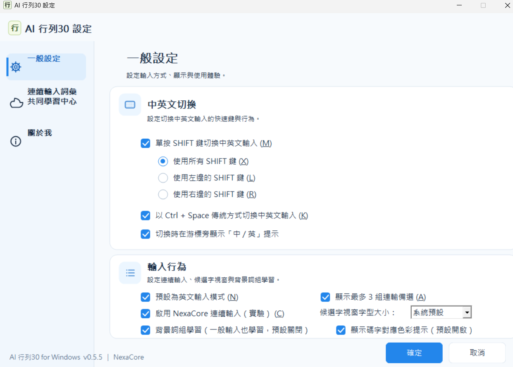
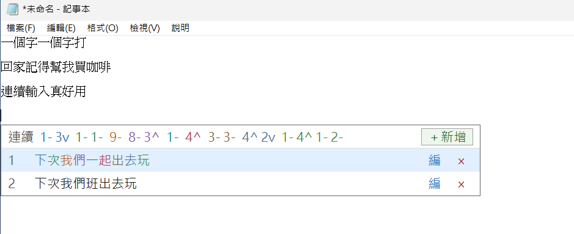
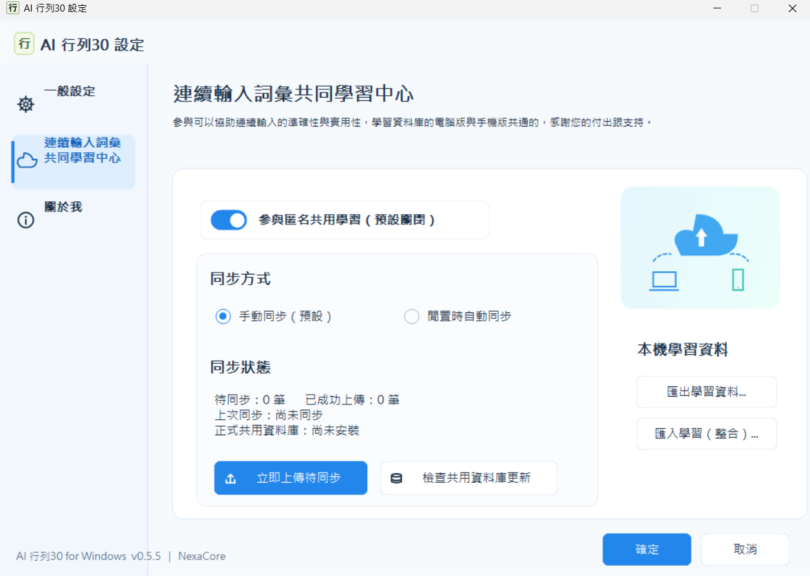
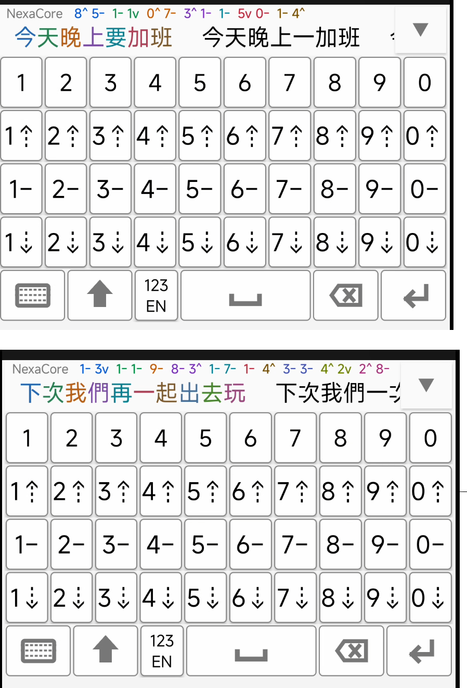
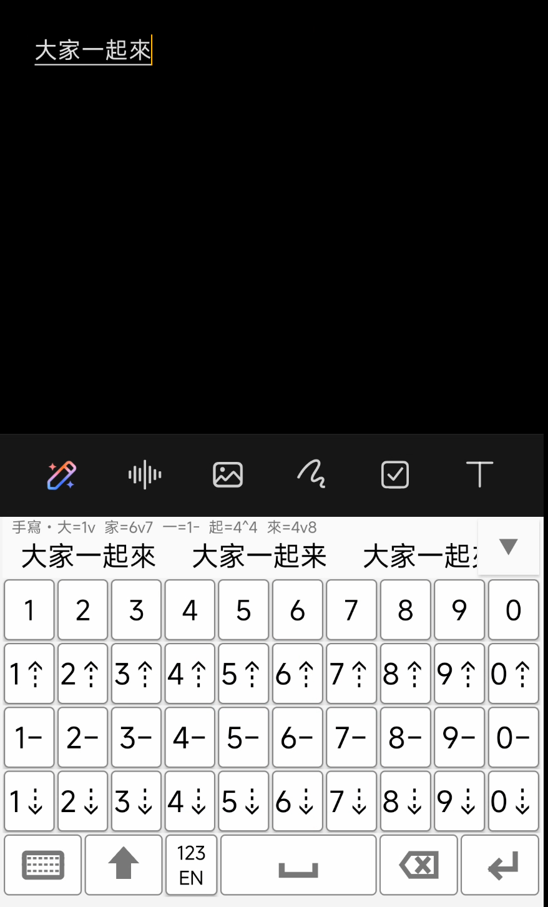
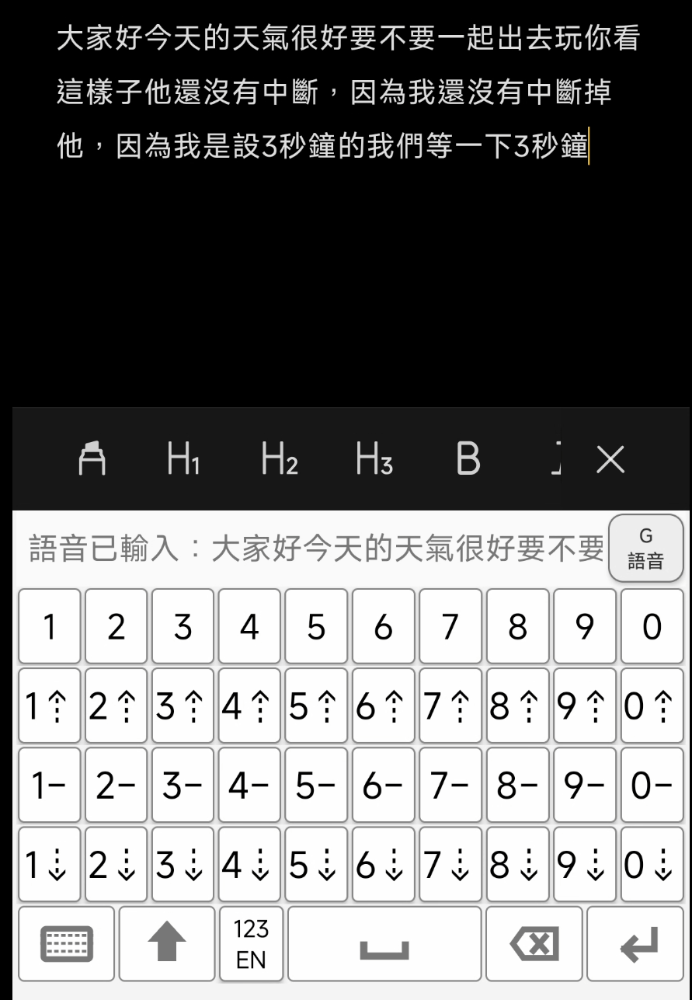
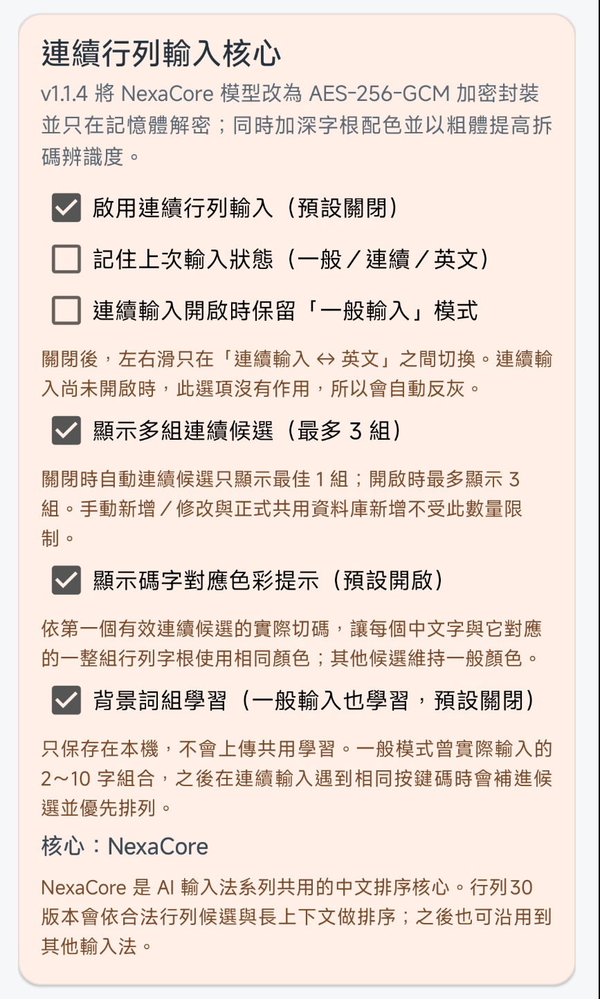
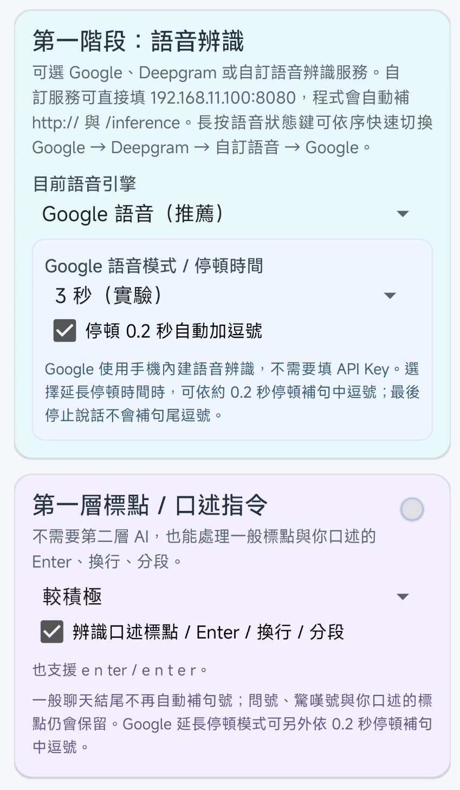
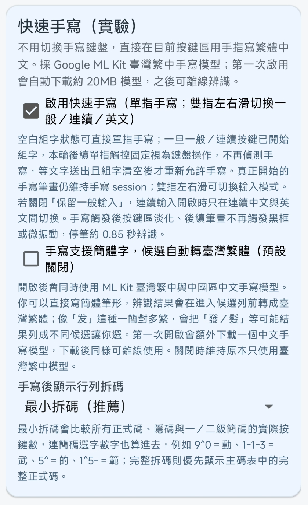
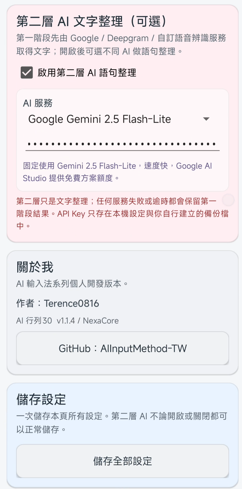

# ⌨️ AI 行列30｜Windows + Android

[](https://github.com/Terence0816/AIArray30/releases)
[](https://github.com/Terence0816/AIArray30/releases/tag/v0.5.8)
[](https://github.com/Terence0816/AIArray30/releases/tag/android-v1.1.5)


**AI 行列30**是在傳統行列30輸入方式上，加入 **NexaCore 連續輸入、個人化學習、背景詞組學習、碼字對應色彩提示**等功能的中文輸入法。

目前同一個 Repository 提供：

- 💻 **Windows 原生 TSF 版**
- 📱 **Android 版**

> 本 Repository 提供程式介紹、畫面與正式安裝版下載，**不公開 AIArray30 原始碼**。

---

# 📥 下載｜Download

> **Windows 與 Android 的最新版本入口放在這裡，不需要依賴 GitHub 右側只能顯示一個的 Latest Release。**

| 平台 | 目前版本 | 下載 |
| --- | --- | --- |
| 💻 **Windows 10 / 11 x64** | **v0.5.8** | **[下載 Windows 安裝版](https://github.com/Terence0816/AIArray30/releases/tag/v0.5.8)** |
| 📱 **Android** | **v1.1.5** | **[下載 Android APK](https://github.com/Terence0816/AIArray30/releases/tag/android-v1.1.5)** |

👉 **[查看所有 Releases / 歷史版本](https://github.com/Terence0816/AIArray30/releases)**

Windows Release 主要提供：

```text
AIArray30_Setup_vX.X.X.exe
AIArray30_Setup_vX.X.X.exe_sha256.txt
```

Android Release 主要提供：

```text
AIArray30_vX.X.X.apk
AIArray30_vX.X.X.apk_sha256.txt
```

---

## 🖼️ Windows / Android

<p align="center">
  
  
</p>

---

# ✨ 主要特色

| 功能 | Windows | Android |
| --- | :---: | :---: |
| 標準行列30輸入 | ✅ | ✅ |
| NexaCore 行列連續輸入 | ✅ | ✅ |
| Top1 / Top3 連續候選 | ✅ | ✅ |
| 碼字對應彩色提示 | ✅ | ✅ |
| 背景詞組學習 | ✅ | ✅ |
| 本機個人化學習 | ✅ | ✅ |
| 匿名共用學習 | ✅ | ✅ |
| 正式 Shared DB 更新 | ✅ | ✅ |
| 連續手寫 | — | ✅ |
| 手寫後顯示行列拆碼 | — | ✅ |
| 不中斷語音輸入 | — | ✅ |
| Google / Deepgram / 自訂 STT | — | ✅ |
| 第二層 AI 文字整理 | — | ✅ |
| Windows TSF | ✅ | — |

---

# 💻 Windows 版

AI 行列30 Windows 版採用 **Microsoft TSF（Text Services Framework）**，以原生 C++ 實作。

除了傳統逐字行列輸入，也可以直接使用 NexaCore 連續輸入；一般輸入與連續輸入可共存，不需要為每一句頻繁切換輸入法。

## 🎬 Windows 操作示範

👉 **[AI 行列30 Windows 版｜連續輸入實測與操作示範](https://youtu.be/O_sohVOYjJQ)**

## 🖼️ Windows 介面預覽

### 一般設定

可設定 Shift／Ctrl + Space 中英文切換、NexaCore 連續輸入、多組候選、背景詞組學習、候選字型與碼字對應色彩提示。



### NexaCore 連續輸入

輸入一整串行列碼後，由 NexaCore 依合法切碼、候選組合與中文上下文進行組句及排序。



### 連續輸入詞彙共用學習中心

共用學習為選用功能，預設關閉。一般正常打字內容與本機背景詞組學習不會因此全部上傳。



## ⌨️ Windows 中英文切換

支援：

- 單按 Shift 切換中／英文
- 可指定所有 Shift、左 Shift 或右 Shift
- 中文模式下按住 Shift 暫時輸入英文／符號，放開後回到原中文模式
- `Ctrl + Space` 傳統切換方式
- 游標附近「中 / 英」狀態提示
- Windows 11「進階鍵盤設定 → 覆寫預設輸入法」

---

# 📱 Android 版

Android 版除了 NexaCore 行列連續輸入，也整合了更適合手機操作的 **連續手寫、語音輸入與自動拆碼提示**。

<p align="center">
  
</p>

## 🧠 NexaCore 行列連續輸入

輸入一整串行列碼後，由 NexaCore 自動建立合法切碼與候選組合，再依中文上下文與學習資料排序。

第一候選可同步顯示：

- 每個中文字
- 對應的一整組行列字根
- 相同顏色的碼字配對

讓使用者能直接看出：

```text
哪一段行列碼 → 對應哪一個中文字
```

<p align="center">
  
</p>

## ✍️ 連續手寫＋自動顯示行列拆碼

Android 版可直接在按鍵區進行快速手寫，不需先切換到另一套手寫鍵盤。

主要特色：

- 支援連續手寫
- 手寫辨識後直接進入候選
- 自動顯示辨識文字的行列拆碼
- 可選「最小拆碼」或其他拆碼顯示方式
- 可選是否加入簡體字辨識並轉為臺灣繁體

<p align="center">
  
</p>

## 🎙️ 不中斷語音輸入

Android 版語音輸入可延長聽寫時間，說話過程持續將內容送入文字欄位，不必每說一句就重新按一次語音鍵。

第一階段語音辨識可選：

- Google 語音
- Deepgram
- 自訂語音辨識服務

並支援停頓補逗號、口述標點 / Enter / 換行 / 分段等行為。

<p align="center">
  
</p>

## 🤖 第二層 AI 文字整理（可選）

第一階段先取得語音辨識文字；若啟用第二層 AI，可再進行語句整理。

目前介面可選 AI 服務，API Key 僅保存在本機設定與使用者自行建立的備份中。

<details>
<summary><b>查看 Android 詳細設定畫面</b></summary>

### NexaCore / 連續輸入設定

<p align="center">
  
</p>

### 語音辨識與停頓設定

<p align="center">
  
</p>

### 快速手寫與拆碼設定

<p align="center">
  
</p>

### 第二層 AI / 關於 / 儲存設定

<p align="center">
  
</p>

</details>

---

# 🧠 NexaCore 連續輸入

傳統行列30通常以逐字輸入為主。

AI 行列30加入 NexaCore 後，可以將一段連續輸入的行列碼先建立合法候選，再依中文上下文進行組句與排序。

NexaCore 會綜合考慮：

- 行列碼合法性
- 合法切碼方式
- 字詞搭配
- 中文上下文
- 個人本機學習
- 背景詞組習慣
- 正式共用資料庫

## Top1 / Top3

設定中可選擇：

- **關閉多組候選**：只顯示最佳 Top1
- **開啟多組候選**：最多顯示 Top3 自動候選

自動產生的候選以 Top3 為限；使用者手動新增或修改的個人候選不受此限制。

---

# 🎨 碼字對應色彩提示

Windows 與 Android 都可以依第一個有效連續候選的**實際切碼結果**，將：

- 行列碼
- 第一候選中的中文字

用相同顏色分組顯示。

不是依字數平均切分，而是依行列碼表實際驗證切碼。

---

# 📚 背景詞組學習

除了明確新增或修改候選外，AI 行列30也可以從一般逐字輸入中學習常用詞組。

例如平常輸入：

```text
我要回家喝咖啡
```

本機可以逐步記住常用的 2～10 字組合，例如：

```text
我要
我要回家
回家喝咖啡
我要回家喝咖啡
```

之後使用連續輸入遇到相同按鍵碼時，可補進候選並改善排序。

> 背景詞組學習只存在本機，不會直接當成共用學習內容上傳。

---

# ☁️ 匿名共用學習

AI 行列30提供選用的共用學習機制，預設關閉。

啟用後，僅將與候選改善相關的必要事件送入共用學習流程，例如：

- 新增候選
- 修改候選
- 刪除／拒絕不適合的候選

一般正常選字不會因此全部送出；本機背景詞組與個人習慣仍保留在本機。

正式 Shared DB 與個人學習互相獨立，個人本機學習具有較高優先權。


---

# 🚀 安裝與更新

## Windows

下載 `AIArray30_Setup_vX.X.X.exe` 後直接執行。

- 未安裝 → 安裝目前版本
- 已安裝舊版本 → 提示更新
- 已安裝相同版本 → 可選擇解除安裝
- 已安裝較新版本 → 舊版 Setup 不直接覆蓋

安裝完成後，可在 Windows 輸入法清單中選擇：

```text
繁體中文（台灣）－ AI 行列30
```

## Android

下載 `AIArray30_vX.X.X.apk` 後安裝。

若 Android 阻擋非商店 APK，需依手機系統提示允許目前使用的瀏覽器或檔案管理程式安裝未知來源 App。

---

# 💻📱 系統需求

| 項目 | Windows | Android |
| --- | --- | --- |
| 作業系統 | Windows 10 / 11 | Android |
| 架構 / 框架 | x64 / Windows TSF | Android IME |
| 安裝檔 | Setup EXE | APK |
| 一般行列輸入 | 離線可用 | 離線可用 |
| NexaCore | 本機執行 | 本機執行 |
| 共用學習 / Shared DB | 需要網路 | 需要網路 |
| 語音 / 第二層 AI | — | 視所選服務需要網路 |

---

# 📁 Repository 結構

建議 Repository 圖片結構：

```text
README.md
assets/
├─ AIArray30_Cover.png
├─ AIArray30_Android_Cover.png
└─ screenshots/
   ├─ general-settings.png
   ├─ continuous-input.png
   ├─ shared-learning-center.png
   └─ android/
      ├─ settings-nexacore.png
      ├─ continuous-input.png
      ├─ voice-input.png
      ├─ handwriting.png
      ├─ settings-ai.png
      ├─ settings-voice.png
      └─ settings-handwriting.png
```

Windows 目前既有的圖片檔名可保持不變，只需要新增 Android 封面與 `assets/screenshots/android/` 內的 Android 圖片即可。

---

# 📦 Release 規劃

Windows 與 Android 使用**同一個 Repository、不同 Release**。

目前：

```text
Windows:
v0.5.8

Android:
android-v1.1.5
```

這樣兩個平台可以各自有自己的版本、APK / EXE 與發行說明，不需要把兩個安裝檔硬塞在同一個 Release。

README 最上方固定提供兩個平台各自的下載入口，因此不受 GitHub 首頁右側只能顯示一個 Latest Release 的限制。

---

# 🔎 搜尋關鍵字

`AIArray30`, `Array30`, `行列30`, `行列輸入法`, `中文輸入法`, `Windows輸入法`, `Android輸入法`, `TSF`, `NexaCore`, `連續輸入`, `連續手寫`, `語音輸入`, `AI輸入法`, `智慧輸入`, `中文打字`, `Traditional Chinese IME`, `Windows IME`, `Android IME`, `Array input method`

---

# ⚠️ 使用說明

AI 行列30仍持續測試與改善 NexaCore 連續輸入、個人學習、候選排序、Shared DB、Android 手寫與語音功能。

不同使用者的輸入習慣不同，連續輸入候選仍可能需要自行選擇、修改或新增。

若遇到問題，建議在 GitHub Issues 提供：

- Windows / Android 版本
- AIArray30 版本
- 問題發生步驟
- 可重現的輸入內容
- 必要時附上畫面截圖

---

## 👤 Author

**Terence0816**

GitHub：**[Terence0816/AIArray30](https://github.com/Terence0816/AIArray30)**

---

如果你覺得 AI 行列30對你有幫助，歡迎在 GitHub 專案點一個 ⭐ Star。
