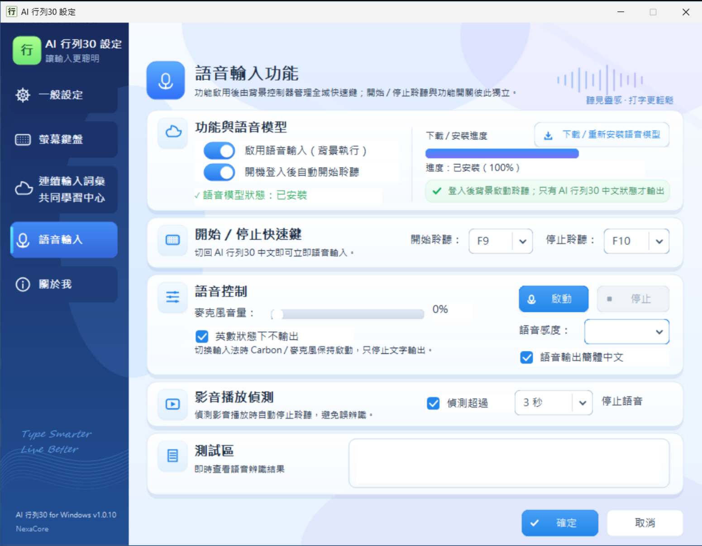
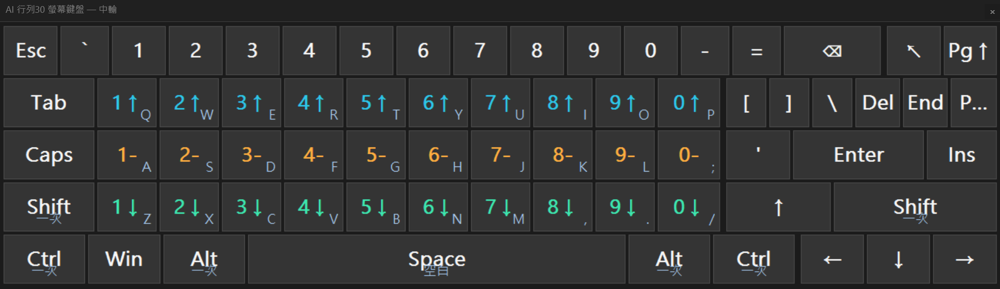
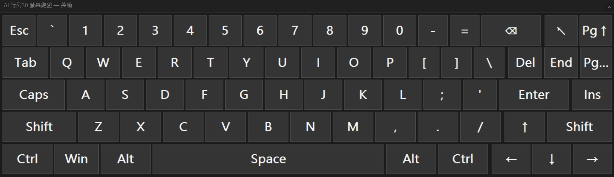
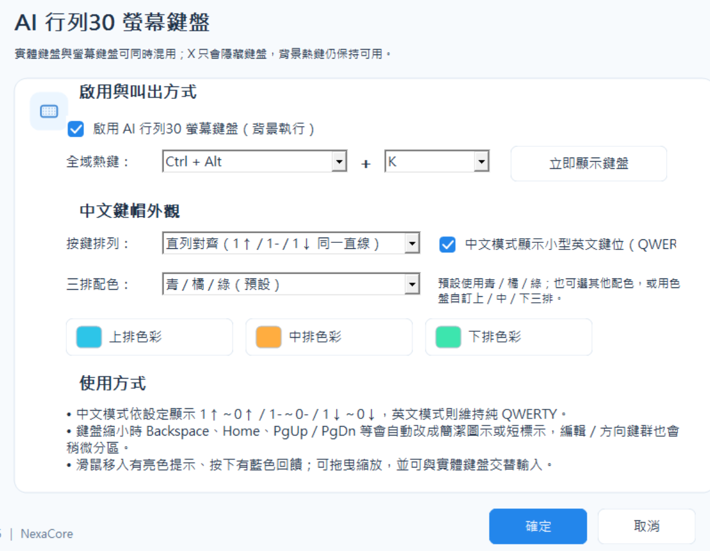

# ⌨️ AI 行列30｜Windows + Android

[](https://github.com/Terence0816/AIArray30/releases)
[](https://github.com/Terence0816/AIArray30/releases/tag/win-v-1.1.7)
[](https://github.com/Terence0816/AIArray30/releases/tag/android-v1.1.5)


**AI 行列30**是在傳統行列30輸入方式上，加入 **NexaCore 連續輸入、個人化學習、背景詞組學習、碼字對應色彩提示**等功能的中文輸入法。

目前同一個 Repository 提供：

- 💻 **Windows 原生 TSF 版**
- 📱 **Android 版**

> 本 Repository 提供程式介紹、畫面與正式安裝版下載，**不公開 AIArray30 原始碼**。

---

# 📥 下載｜Download

> **Windows 與 Android 的最新版本入口固定放在這裡，不需要依賴 GitHub 右側只能顯示一個的 Latest Release。**

| 項目 | 目前版本 | 下載 | 影片 |
| --- | --- | --- | --- |
| 💻 **Windows 10 / 11** | **v1.1.7** | **[下載 Windows 安裝版](https://github.com/Terence0816/AIArray30/releases/tag/win-v-1.1.7)** | **[YouTube 示範教學](https://youtu.be/O_sohVOYjJQ)** |
| 📱 **Android** | **v1.1.5** | **[下載 Android APK](https://github.com/Terence0816/AIArray30/releases/tag/android-v1.1.5)** | **[YouTube 示範教學](https://youtu.be/YV7B3DLtNjY)** |
| 🧩 **行列30 二級簡碼練習工具** | **v0.1.7** | **[下載練習工具](https://github.com/Terence0816/AIArray30/releases/download/v0.5.8/Array30Trainer.zip)** | — |

👉 **[查看所有 Releases / 歷史版本](https://github.com/Terence0816/AIArray30/releases)**

Windows Release 主要提供：

```text
AIArray30_Setup_vX.X.X.exe
AIArray30_Setup_vX.X.X.exe_sha256.txt
```

Android Release 主要提供：

```text
AIArray30_vX.X.X.apk
AIArray30_vX.X.X.apk_sha256.txt
```

---

## 🖼️ Windows / Android

<p align="center">
  
  
</p>

---

# ✨ 主要特色

| 功能 | Windows | Android |
| --- | :---: | :---: |
| 標準行列30輸入 | ✅ | ✅ |
| NexaCore 行列連續輸入 | ✅ | ✅ |
| Top1 / Top3 連續候選 | ✅ | ✅ |
| 碼字對應彩色提示 | ✅ | ✅ |
| 背景詞組學習 | ✅ | ✅ |
| 本機個人化學習 | ✅ | ✅ |
| 匿名共用學習 | ✅ | ✅ |
| 正式 Shared DB 更新 | ✅ | ✅ |
| 個人學習匯出 / 匯入 | ✅ | ✅ |
| AI 行列30 專屬螢幕鍵盤 | ✅ | — |
| 螢幕鍵盤按鍵提示音 | ✅ | — |
| 螢幕鍵盤語音 Start / Stop | ✅ | — |
| Shift 臨時英文輸入 | ✅ | — |
| Windows TSF | ✅ | — |
| 連續手寫 | — | ✅ |
| 手寫後顯示行列拆碼 | — | ✅ |
| 不中斷語音輸入 | — | ✅ |
| Google / Deepgram / 自訂 STT | — | ✅ |
| 第二層 AI 文字整理 | — | ✅ |

---

# 💻 Windows 版

AI 行列30 Windows 版採用 **Microsoft TSF（Text Services Framework）**，以原生 C++ 實作。

除了傳統逐字行列輸入，也可以直接使用 NexaCore 連續輸入；一般輸入與連續輸入可共存，不需要為每一句頻繁切換輸入法。

Windows 11 x64 系統中同時提供 **x64 + x86 TSF**，因此可支援 64 位元與 32 位元應用程式。

## 🆕 Windows v0.7.5 ～ v1.1.7 主要更新

### ⌨️ 螢幕鍵盤功能強化

- 螢幕鍵盤可縮小成更精簡的尺寸。
- 優化小尺寸顯示，Backspace、Home、PgUp / PgDn 等按鍵會自動改用簡潔圖示或短標示，避免文字擠壓。
- 支援縮小至工作列暫時隱藏，不需完全關閉程式。
- 新增螢幕鍵盤按鍵提示音，可於設定中開啟／關閉。
- 全面調整鍵盤版面與按鍵比例，放大主要輸入區並縮小右側功能區佔用空間。
- 完善 Enter、Backspace、左右 Shift、Home、End、PgUp、PgDn、Del、Ins、PrSc、Menu 與方向鍵配置。
- 新增 **Fn** 功能鍵，可將數字列切換為 **F1 ～ F12**。
- 修正數字列與行列碼按鍵垂直對齊，讓 `1 ～ 0`、`1↑ ～ 0↑`、`1- ～ 0-`、`1↓ ～ 0↓` 共用一致欄位。
- 完善 Shift 狀態下的符號顯示，例如 `[] → {}`、`\ → |` 與數字列 Shift 符號。
- 修正候選字視窗遮擋螢幕鍵盤的問題；重疊時螢幕鍵盤會維持較高顯示與操作優先權，候選字仍可正常使用。
- 標題列新增麥克風按鈕，可直接開始／停止語音聆聽，並同步顯示目前語音狀態。
- 更新麥克風按鈕與 Enter 鍵圖示，提升辨識度與整體質感。
- 改善螢幕鍵盤微透明、藍色發光邊框、白字與行列碼配色顯示。

### 🎨 設定介面全面重新設計

- 全面重新設計設定介面，改用現代化卡片式版面。
- 新增深藍色漸層左側導覽列。
- 新增淡藍色漸層背景與視覺光影效果。
- 整體重新調整版面、間距、圖示、控制項與視覺一致性。

### 🎙 新增語音輸入功能

> 語音輸入功能限定搭配 AI 行列30 輸入法使用。



- 新增背景語音聆聽模式。
- 可自訂 **開始聆聽 / 停止聆聽** 快速鍵。
- 可設定 Windows 登入後自動啟用語音聆聽。
- 新增 **英數狀態下不輸出** 選項。
- 新增 5 段語音感度調整。
- 新增即時麥克風音量顯示。
- 新增語音辨識測試區。
- 新增手動 **啟動 / 停止** 語音控制。
- 新增獨立的 **語音輸出簡體中文** 功能。
- 新增影音播放偵測，可設定影音連續播放超過指定秒數後自動停止語音。

### 🀄 新增簡體中文輸出

- 新增 **輸出簡體中文** 選項。
- 行列拆碼、候選字詞、學習資料、使用者詞庫及編輯內容，內部仍全部維持繁體中文。
- 只有在文字真正輸出到應用程式時，才進行繁體 → 簡體轉換。
- 一般輸入與連續輸入皆支援簡體中文輸出。
- 語音輸入另有獨立的簡體中文輸出開關，可與鍵盤輸入分開設定。

👉 **[查看 Windows v1.1.7 Release](https://github.com/Terence0816/AIArray30/releases/tag/win-v-1.1.7)**

## 🆕 Windows v0.5.9 ～ v0.7.5 主要更新

- 修復搭配 Windows 系統螢幕小鍵盤時，Chrome / Edge / Brave / Facebook 等瀏覽器的候選窗定位問題。
- 修復中文模式下按住 **Shift** 臨時輸入英文後，部分軟體無法自動回到中文模式的問題。
- 完善個人學習資料 **匯出 / 匯入**，包含候選順序、個人修改句子、背景詞組學習與相關輸入習慣。
- 新增 **AI 行列30 專屬螢幕鍵盤**，支援行列鍵位、中英即時切換、三排配色、自訂色盤、大小 / 位置調整與自訂熱鍵。
- 重新設計「連續輸入句子」的新增 / 編輯介面，加入碼字對應配色、即時錯誤辨識與長句自動延伸。
- 修復連續句子編輯視窗確認 / 取消時可能造成宿主程式閃退的問題。
- 修復工作列右下角「中 / 英」狀態偶爾消失，需要按 Shift 才恢復顯示的問題。

👉 **[查看 Windows v0.7.5 Release](https://github.com/Terence0816/AIArray30/releases/tag/win-v0.7.5)**

## 🎬 Windows 操作示範

👉 **[AI 行列30 Windows 版｜連續輸入實測與操作示範](https://youtu.be/O_sohVOYjJQ)**

## 🖼️ Windows 介面預覽

### 一般設定

可設定 Shift／Ctrl + Space 中英文切換、NexaCore 連續輸入、多組候選、背景詞組學習、候選字型與碼字對應色彩提示。


### ⌨️ AI 行列30 專屬螢幕鍵盤

Windows 版內建 AI 行列30 專屬螢幕鍵盤，可與實體鍵盤同時交替輸入。

中文模式會直接顯示行列30鍵位，預設使用：

- **上排：青色** `1↑ ～ 0↑`
- **中排：橘色** `1- ～ 0-`
- **下排：綠色** `1↓ ～ 0↓`
- 可選擇是否顯示小型 QWERTY 英文鍵位
- 切到英文模式後自動恢復純 QWERTY 鍵盤

<p align="center">
  
  
</p>

螢幕鍵盤支援：

- 自訂全域呼出熱鍵
- 背景常駐，按 X 只隱藏鍵盤
- 可自由拖曳與縮放
- 自動記住位置與大小
- 中文 / 英文狀態即時同步
- 實體鍵盤與螢幕鍵盤交替輸入
- 滑鼠移入與按下視覺回饋
- 按鍵提示音，可於設定中開啟／關閉
- 標題列麥克風按鈕，可直接開始／停止語音聆聽
- Fn → F1 ～ F12 功能鍵
- 完整的 Enter、Backspace、雙 Shift、PrSc、Menu、方向鍵與導覽鍵配置
- 候選字視窗與鍵盤重疊時，螢幕鍵盤維持較高顯示與操作優先權
- 小尺寸時自動簡化部分功能鍵顯示
- 行列鍵位可選直列對齊或傳統鍵位排列
- 三排配色可選預設方案或使用 Windows 色盤自訂

<p align="center">
  
</p>

### NexaCore 連續輸入

輸入一整串行列碼後，由 NexaCore 依合法切碼、候選組合與中文上下文進行組句及排序。


### 連續輸入句子新增 / 編輯

Windows 版可直接新增或修改連續輸入候選句子，並依目前按碼即時驗證。

主要功能：

- 按碼只顯示行列碼，不顯示 QWERTY 英文字母
- 正確中文字與其對應按碼以相同顏色顯示
- 從第一個錯字開始顯示粗體深紅色
- 未匹配按碼顯示為白灰底與灰字
- 鍵碼不符時顯示黃色警告區
- 長句會自動加寬、換行與增加輸入框高度
- 超長內容可在輸入框內捲動
- 新增／編輯候選詞句時加大文字顯示，提升閱讀與修改便利性

### 連續輸入詞彙共用學習中心

共用學習為選用功能，預設關閉。一般正常打字內容與本機背景詞組學習不會因此全部上傳。


## ⌨️ Windows 中英文切換

支援：

- 單按 Shift 切換中／英文
- 可指定所有 Shift、左 Shift 或右 Shift
- 中文模式下按住 Shift 暫時輸入英文／符號，放開後回到原中文模式
- `Ctrl + Space` 傳統切換方式
- 工作列右下角「中 / 英」輸入狀態顯示
- 螢幕鍵盤跟隨目前中 / 英模式同步切換
- Windows 11「進階鍵盤設定 → 覆寫預設輸入法」

## 💾 個人學習匯出 / 匯入

Windows 版可將個人使用習慣匯出後帶到另一台電腦。

匯出內容包含：

- 個人新增 / 修改的連續句子
- 拒絕候選資料
- 候選選擇與排序學習
- 一般逐字輸入累積的背景詞組學習
- Windows 個人輸入設定
- 螢幕鍵盤相關設定

共同學習服務是否啟用不會因匯入個人資料而自動開啟。

---

# 🧩 行列30 二級簡碼練習工具

另外提供獨立的 **行列30 二級簡碼練習工具 v0.1.7**，可用來練習與熟悉二級簡碼按鍵。

👉 **[下載 Array30Trainer.zip](https://github.com/Terence0816/AIArray30/releases/download/v0.5.8/Array30Trainer.zip)**

主要功能：

- 二級簡碼練習
- 顯示中文字、英文按碼與行列按鍵
- 正確 / 錯誤即時統計
- 正確率與練習時間顯示
- 順序練習
- 隨機練習（可重複）
- 隨機練習（不可重複）
- 常錯字練習
- 可設定練習範圍
- 可提高錯誤字再次出現的頻率
- 可設定同字連續答對後自動排除
- 語音提示與語速調整

> 練習工具為獨立 Windows 小工具，不影響 AI 行列30 輸入法本體。

<p align="center">
  
</p>

---

# 📱 Android 版

Android 版除了 NexaCore 行列連續輸入，也整合了更適合手機操作的 **連續手寫、語音輸入與自動拆碼提示**。

## 🎬 Android 操作示範

👉 **[AI 行列30 Android 版｜YouTube 示範教學](https://youtu.be/YV7B3DLtNjY)**

<p align="center">
  
</p>

## 🧠 NexaCore 行列連續輸入

輸入一整串行列碼後，由 NexaCore 自動建立合法切碼與候選組合，再依中文上下文與學習資料排序。

第一候選可同步顯示：

- 每個中文字
- 對應的一整組行列字根
- 相同顏色的碼字配對

讓使用者能直接看出：

```text
哪一段行列碼 → 對應哪一個中文字
```

<p align="center">
  
</p>

## ✍️ 連續手寫＋自動顯示行列拆碼

Android 版可直接在按鍵區進行快速手寫，不需先切換到另一套手寫鍵盤。

主要特色：

- 支援連續手寫
- 手寫辨識後直接進入候選
- 自動顯示辨識文字的行列拆碼
- 可選「最小拆碼」或其他拆碼顯示方式
- 可選是否加入簡體字辨識並轉為臺灣繁體

<p align="center">
  
</p>

## 🎙️ 不中斷語音輸入

Android 版語音輸入可延長聽寫時間，說話過程持續將內容送入文字欄位，不必每說一句就重新按一次語音鍵。

第一階段語音辨識可選：

- Google 語音
- Deepgram
- 自訂語音辨識服務

並支援停頓補逗號、口述標點 / Enter / 換行 / 分段等行為。

<p align="center">
  
</p>

## 🤖 第二層 AI 文字整理（可選）

第一階段先取得語音辨識文字；若啟用第二層 AI，可再進行語句整理。

目前介面可選 AI 服務，API Key 僅保存在本機設定與使用者自行建立的備份中。

<details>
<summary><b>查看 Android 詳細設定畫面</b></summary>

### NexaCore / 連續輸入設定

<p align="center">
  
</p>

### 語音辨識與停頓設定

<p align="center">
  
</p>

### 快速手寫與拆碼設定

<p align="center">
  
</p>

### 第二層 AI / 關於 / 儲存設定

<p align="center">
  
</p>

</details>

---

# 🧠 NexaCore 連續輸入

傳統行列30通常以逐字輸入為主。

AI 行列30加入 NexaCore 後，可以將一段連續輸入的行列碼先建立合法候選，再依中文上下文進行組句與排序。

NexaCore 會綜合考慮：

- 行列碼合法性
- 合法切碼方式
- 字詞搭配
- 中文上下文
- 個人本機學習
- 背景詞組習慣
- 正式共用資料庫

## Top1 / Top3

設定中可選擇：

- **關閉多組候選**：只顯示最佳 Top1
- **開啟多組候選**：最多顯示 Top3 自動候選

自動產生的候選以 Top3 為限；使用者手動新增或修改的個人候選不受此限制。

---

# 🎨 碼字對應色彩提示

Windows 與 Android 都可以依第一個有效連續候選的**實際切碼結果**，將：

- 行列碼
- 第一候選中的中文字

用相同顏色分組顯示。

不是依字數平均切分，而是依行列碼表實際驗證切碼。

---

# 📚 背景詞組學習

除了明確新增或修改候選外，AI 行列30也可以從一般逐字輸入中學習常用詞組。

例如平常輸入：

```text
我要回家喝咖啡
```

本機可以逐步記住常用的 2～10 字組合，例如：

```text
我要
我要回家
回家喝咖啡
我要回家喝咖啡
```

之後使用連續輸入遇到相同按鍵碼時，可補進候選並改善排序。

> 背景詞組學習只存在本機，不會直接當成共用學習內容上傳。

---

# ☁️ 匿名共用學習

AI 行列30提供選用的共用學習機制，預設關閉。

啟用後，僅將與候選改善相關的必要事件送入共用學習流程，例如：

- 新增候選
- 修改候選
- 刪除／拒絕不適合的候選

一般正常選字不會因此全部送出；本機背景詞組與個人習慣仍保留在本機。

正式 Shared DB 與個人學習互相獨立，個人本機學習具有較高優先權。

---

# 🔐 NexaCore 核心保護

Windows 與 Android 正式版的 NexaCore 模型採加密封裝。

- AES-256-GCM
- 完整性驗證
- 執行時於記憶體中解密 / 載入
- 不將原始明文模型作為正式發布檔直接提供

加密主要發生在核心載入階段；正常輸入時直接使用已載入的模型，不會每打一個字重新解密。

---

# 🚀 安裝與更新

## Windows

下載 `AIArray30_Setup_vX.X.X.exe` 後直接執行。

- 未安裝 → 安裝目前版本
- 已安裝舊版本 → 提示更新
- 已安裝相同版本 → 可選擇解除安裝
- 已安裝較新版本 → 舊版 Setup 不直接覆蓋

安裝完成後，可在 Windows 輸入法清單中選擇：

```text
繁體中文（台灣）－ AI 行列30
```

## Android

下載 `AIArray30_vX.X.X.apk` 後安裝。

若 Android 阻擋非商店 APK，需依手機系統提示允許目前使用的瀏覽器或檔案管理程式安裝未知來源 App。

---

# 💻📱 系統需求

| 項目 | Windows | Android |
| --- | --- | --- |
| 作業系統 | Windows 10 / 11 | Android |
| 架構 / 框架 | Windows x64 / TSF（支援 x86、x64 應用程式） | Android IME |
| 安裝檔 | Setup EXE | APK |
| 一般行列輸入 | 離線可用 | 離線可用 |
| NexaCore | 本機執行 | 本機執行 |
| 共用學習 / Shared DB | 需要網路 | 需要網路 |
| 語音輸入 | ✅（需先安裝語音模型） | ✅（視所選服務可能需要網路） |
| 第二層 AI | — | ✅（視所選服務需要網路） |

---

# 📁 Repository 結構

建議 Repository 圖片結構：

```text
README.md
assets/
├─ AIArray30_Cover.png
├─ AIArray30_Android_Cover.png
├─ tools/
│  └─ array30-level2-trainer.png
└─ screenshots/
   ├─ general-settings.png
   ├─ continuous-input.png
   ├─ shared-learning-center.png
   ├─ screen-keyboard-chinese.png
   ├─ screen-keyboard-english.png
   ├─ screen-keyboard-settings.png
   ├─ AIArray30_v1.1.0_voice_input.png
   └─ android/
      ├─ settings-nexacore.png
      ├─ continuous-input.png
      ├─ voice-input.png
      ├─ handwriting.png
      ├─ settings-ai.png
      ├─ settings-voice.png
      └─ settings-handwriting.png
```

---

# 📦 Release 規劃

Windows 與 Android 使用**同一個 Repository、不同 Release**。

目前：

```text
Windows:
win-v-1.1.7

Android:
android-v1.1.5
```

這樣兩個平台可以各自有自己的版本、APK / EXE 與發行說明，不需要把兩個安裝檔硬塞在同一個 Release。

README 最上方固定提供兩個平台各自的下載入口，因此不受 GitHub 首頁右側只能顯示一個 Latest Release 的限制。

---

# 🔎 搜尋關鍵字

`AIArray30`, `Array30`, `行列30`, `行列輸入法`, `中文輸入法`, `Windows輸入法`, `Android輸入法`, `TSF`, `NexaCore`, `連續輸入`, `連續手寫`, `螢幕鍵盤`, `On-Screen Keyboard`, `語音輸入`, `AI輸入法`, `智慧輸入`, `中文打字`, `Traditional Chinese IME`, `Windows IME`, `Android IME`, `Array input method`

---

# ⚠️ 使用說明

AI 行列30仍持續測試與改善 NexaCore 連續輸入、個人學習、候選排序、Shared DB、Windows 螢幕鍵盤、Android 手寫與語音功能。

不同使用者的輸入習慣不同，連續輸入候選仍可能需要自行選擇、修改或新增。

若遇到問題，建議在 GitHub Issues 提供：

- Windows / Android 版本
- AIArray30 版本
- 問題發生步驟
- 可重現的輸入內容
- 必要時附上畫面截圖

---

## 👤 Author

**Terence0816**

GitHub：**[Terence0816/AIArray30](https://github.com/Terence0816/AIArray30)**

---

如果你覺得 AI 行列30對你有幫助，歡迎在 GitHub 專案點一個 ⭐ Star。
